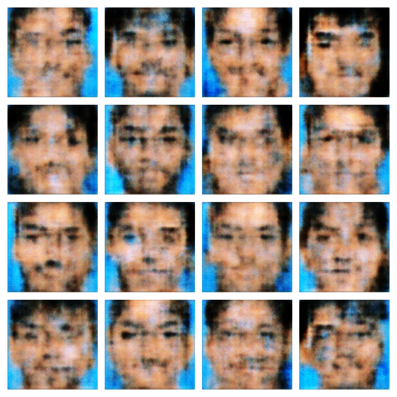
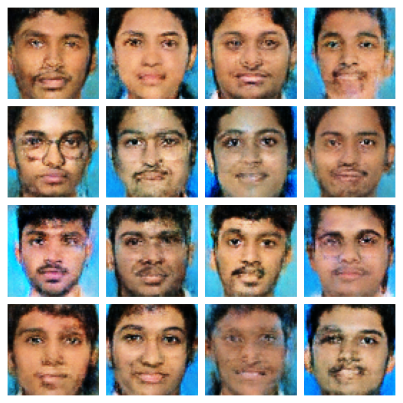
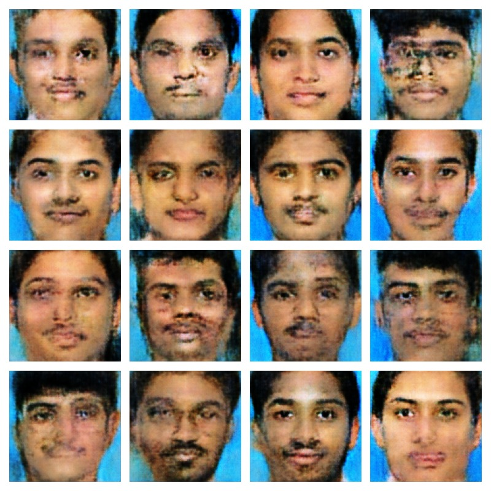
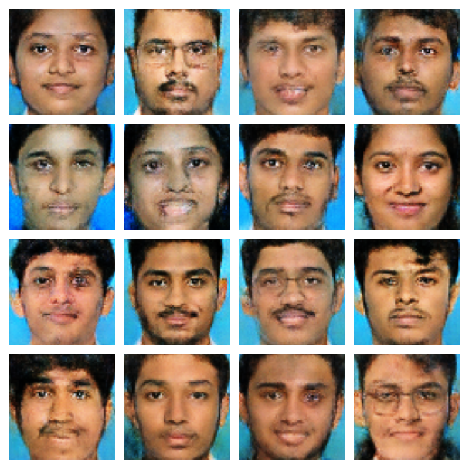
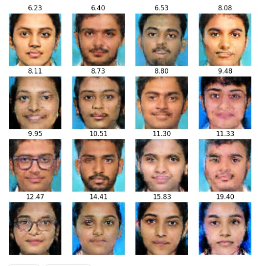

# AI Human Face Generation using WGAN-GP

## Table of Contents

* [Overview](#overview)
* [Objectives](#objectives)
* [Dataset Description](#dataset-description)
* [Requirements](#requirements)
* [Installation](#installation)
* [Preprocessing & Augmentation](#preprocessing--augmentation)
* [Project Structure](#project-structure)
* [Model Architecture](#model-architecture)

  * [Generator](#generator)
  * [Critic](#critic)
* [Training Configuration](#training-configuration)
* [Loss Curve Analysis](#loss-curve-analysis)
* [Features](#features)
* [Results](#results)
* [Training Evaluation](#training-evaluation)
* [Problems Faced](#problems-faced)
* [Solutions Implemented](#solutions-implemented)
* [Performance Summary](#performance-summary)
* [Future Improvements](#future-improvements)

---

# Overview

This project implements a Wasserstein Generative Adversarial Network with Gradient Penalty (WGAN-GP) to generate realistic human face images from random noise vectors.

The model was trained on a custom dataset of student face images and improved through multiple experiments involving face cropping, checkpoint management, loss monitoring, and image quality evaluation.

---

# Objectives

* Generate realistic human face images.
* Learn and implement GAN architectures.
* Improve GAN training stability using WGAN-GP.
* Reduce mode collapse and divergence.
* Evaluate generated image quality using Inception Score.
* Build an end-to-end image generation pipeline.

---

# Dataset Description

| Property      | Value               |
| ------------- | ------------------- |
| Dataset Type  | Custom Face Dataset |
| Total Images  | 2,776               |
| Resolution    | 64×64 and 128×128   |
| Channels      | RGB                 |
| Format        | JPG / PNG           |
| Normalization | [-1,1]              |

The dataset contains student face photographs captured under relatively consistent lighting conditions and backgrounds.

---

# Requirements

```bash
tensorflow
keras
numpy
matplotlib
opencv-python
pillow
tqdm
torch
torchmetrics
torch-fidelity
```

---

# Installation

```bash
git clone https://github.com/your-username/human-face-generator.git

cd human-face-generator

pip install -r requirements.txt
```

---

# Preprocessing & Augmentation

## Face Detection and Cropping

A Haar Cascade Face Detector was used to automatically detect and crop faces before training.

Benefits:

* Removes unnecessary background information.
* Forces the GAN to focus on facial features.
* Improves training efficiency.
* Improves generated face quality.

## Image Preprocessing

* Face detection
* Face cropping
* Resize to 64×64
* RGB conversion
* Normalize to [-1,1]

## Data Augmentation

Implemented:

```python
RandomFlip("horizontal")
```

Benefits:

* Increased diversity
* Improved generalization
* Reduced overfitting

---

# Project Structure

```text
Human_Face_Generator/
│
├── dataset/
├── generated_images/
├── checkpoints/
├── graphs/
├── logs/
├── notebook.ipynb
├── README.md
└── requirements.txt
```

---

# Model Architecture

## Generator

Input:

```text
100-Dimensional Noise Vector
```

Architecture:

```text
Dense
↓
BatchNorm
↓
LeakyReLU
↓
Reshape (4×4×512)
↓
Conv2DTranspose 256
↓
BatchNorm
↓
LeakyReLU
↓
Conv2DTranspose 128
↓
BatchNorm
↓
LeakyReLU
↓
Conv2DTranspose 64
↓
BatchNorm
↓
LeakyReLU
↓
Conv2DTranspose 3
↓
Tanh
```

Output:

```text
64×64×3 Face Image
```

---

## Critic

Architecture:

```text
Input Image
↓
Conv2D 64
↓
LeakyReLU
↓
Conv2D 128
↓
LeakyReLU
↓
Conv2D 256
↓
LeakyReLU
↓
Conv2D 512
↓
LeakyReLU
↓
Flatten
↓
Dense(1)
```

Notes:

* No Sigmoid Layer
* No Dropout Layer
* No Batch Normalization

Implemented according to WGAN-GP recommendations.

---
# Architecture Evolution

During development, multiple experiments were performed to improve image quality and training stability.

---

## Experiment 1: Face Cropping + 128×128 Resolution

The dataset was preprocessed using Haar Cascade face detection to crop and center facial regions before training.

Configuration:

* Face Cropping: Enabled
* Image Resolution: 128×128
* GAN Type: WGAN-GP

### Generator Architecture

```text
100-D Noise Vector
↓
Dense (4×4×512)
↓
BatchNorm + LeakyReLU
↓
Conv2DTranspose (256)
↓
BatchNorm + LeakyReLU
↓
Conv2DTranspose (128)
↓
BatchNorm + LeakyReLU
↓
Conv2DTranspose (64)
↓
BatchNorm + LeakyReLU
↓
Conv2DTranspose (32)
↓
BatchNorm + LeakyReLU
↓
Conv2DTranspose (3)
↓
Tanh
```
## Critic Architecture (128×128 Model)
```text
Input:

128×128×3 Image
↓
Conv2D (64)
↓
LeakyReLU
↓
Conv2D (128)
↓
LeakyReLU
↓
Conv2D (256)
↓
LeakyReLU
↓
Conv2D (512)
↓
LeakyReLU
↓
Flatten
↓
Dense(1)
```
Output:
Single Wasserstein Score

The Critic receives a 128×128 RGB image and learns to distinguish real images from generated images using the Wasserstein loss.
Output:

Results:

* Generated recognizable face structures
* Better facial symmetry
* Improved eye placement
* Improved mouth generation
* More realistic facial appearance
## Metrics:
```text
Inception Score: 1.4404
Std: 0.0573
```
## Experiment 2: Face Cropping + 64×64 Resolution

After evaluating the 128×128 model, the architecture was modified to generate 64×64 images and training was continued using the same cropped-face dataset.

### Generator Architecture

```text
100-D Noise Vector
↓
Dense (4×4×512)
↓
BatchNorm + LeakyReLU
↓
Conv2DTranspose (256)
↓
BatchNorm + LeakyReLU
↓
Conv2DTranspose (128)
↓
BatchNorm + LeakyReLU
↓
Conv2DTranspose (64)
↓
BatchNorm + LeakyReLU
↓
Conv2DTranspose (3)
↓
Tanh
```
### Critic Architecture (64×64 Model)
```text
Input:

64×64×3 Image
↓
Conv2D (64)
↓
LeakyReLU
↓
Conv2D (128)
↓
LeakyReLU
↓
Conv2D (256)
↓
LeakyReLU
↓
Conv2D (512)
↓
LeakyReLU
↓
Flatten
↓
Dense(1)
```
Output:

### Single Wasserstein Score

The Critic receives a 64×64 RGB image and evaluates its realism. After reducing the resolution from 128×128 to 64×64, the Critic input size was updated accordingly while maintaining the WGAN-GP design.

Results:

* More stable training
* Better overall face consistency
* Improved facial structure generation
* Cleaner outputs with fewer artifacts
* Higher Inception Score
### Metrics:
```text
Inception Score: 1.5075
Std: 0.0952
```

Observation:

Although the 128×128 model generated higher-resolution images, the 64×64 model achieved a higher Inception Score and produced more consistent results on the available dataset of 2,776 face images.

# Comparison Bwtween first and Second Arhitecture Change

| Feature            | 128×128 Model | 64×64 Model |
| ------------------ | ------------- | ----------- |
| Face Cropping      | Yes           | Yes         |
| Resolution         | 128×128       | 64×64       |
| Generator Output | 128×128×3     | 64×64×3     |
| Critic Input     | 128×128×3     | 64×64×3     |
| Inception Score    | 1.4404        | 1.5075      |
| Face Quality       | Good          | Better      |
| Training Stability | Good          | Better      |
| Training Time      | Higher        | Lower       |
| GPU Memory Usage   | Higher        | Lower       |

---


## Analysis

Interestingly, reducing the output resolution from 128×128 to 64×64 resulted in a higher Inception Score.

Possible reasons:

* The dataset size (2,776 images) was relatively small for high-quality 128×128 generation.
* The model learned facial structures more effectively at 64×64 resolution.
* Lower resolution reduced training complexity and improved convergence.
* Face cropping allowed the model to focus on facial features rather than background information.

---

## Conclusion

The final 64×64 model trained on cropped facial images achieved the best quantitative performance.

Final Best Result:

```text
Inception Score: 1.5075 ± 0.0952
```

This experiment demonstrated that, for the current dataset size, a well-trained 64×64 WGAN-GP produced better results than the higher-resolution 128×128 version.


# Training Configuration

```python
IMAGE_SIZE = 64

LATENT_DIM = 100

BATCH_SIZE = 64

GEN_LR = 1e-4
DISC_LR = 1e-4

CRITIC_ITERATIONS = 5

LAMBDA_GP = 10

BETA_1 = 0.0
BETA_2 = 0.9
```

---

# Loss Curve Analysis

## 128×128 Architecture

<p align="center">
  
</p>

Observations:

* Large loss fluctuations during early epochs.
* Critic initially dominated Generator learning.
* Training eventually stabilized.
* Higher computational complexity.
* Lower Inception Score compared to the 64×64 model.

Metrics:

```text
Inception Score: 1.4404 ± 0.0573
```

---

## 64×64 Architecture

<p align="center">
  
</p>

Observations:

* Smooth Generator and Critic loss curves.
* Stable adversarial training.
* Better Generator-Critic balance.
* Faster convergence.
* Improved image quality on the available dataset.

Metrics:

```text
Inception Score: 1.5075 ± 0.0952
```

---

## Conclusion

Although the 128×128 architecture generated higher-resolution images, the 64×64 architecture achieved:

* More stable training
* Better convergence
* Higher Inception Score
* Better overall performance on the dataset of 2,776 cropped face images

The 64×64 model was selected as the final model for this project.

---

# Features

* WGAN-GP Implementation
* Gradient Penalty
* Face Detection & Cropping
* TensorFlow Dataset Pipeline
* Checkpoint Saving
* Generated Image Saving
* TensorBoard Logging
* Loss Monitoring
* Inception Score Evaluation
* GPU Training Support

---

# Results

## Generated Images

## Architecture Comparison

| 128×128 Model | 64×64 Model |
|-------------|---------------|
|  |  |
|  |  |
|  |  |
| Best 64×64 Output | Best 128×128 Output |

The model gradually learned:

* Face structure
* Eyes
* Nose
* Mouth
* Hair
* Clothing patterns
* Background consistency

---

# Training Evaluation

## Training Stability

Final observed losses:

```text
Generator Loss ≈ -14
Critic Loss ≈ -26
```

Observations:

* Stable training
* No exploding gradients
* No NaN losses
* No divergence

---

## Mode Collapse Analysis

Checks performed:

* Visual inspection
* Diversity analysis

Observed:

✅ Different face shapes

✅ Different hairstyles

✅ Different genders

✅ Different facial structures

Conclusion:

No significant mode collapse detected.

---

## Divergence Analysis

Results:

```text
Generator NaN : False
Critic NaN    : False
```

Conclusion:

No training divergence detected.

---

## Inception Score Evaluation

Results:

```text
Inception Score : 1.5075
Std             : 0.0952
```

Observation:

Face cropping improved facial feature learning, while the final 64×64 architecture achieved a higher Inception Score (1.5075) than the earlier 128×128 architecture (1.4404).

---

# Problems Faced

## 1. Generated Images Were Pure Noise

Early training produced blurry noise patterns instead of recognizable faces.

---

## 2. Critic Became Too Strong

The Critic model became overly powerful, resulting in unstable training dynamics where the Generator struggled to learn meaningful patterns. This was evident from diverging loss values and poor image quality.

Result:

* Unstable training
* Poor generator learning

---

## 3. Checkpoint Confusion

Older checkpoints were accidentally reused across experiments.

---

## 4. Mixed Old and New Generated Images

Generated image folders contained outputs from previous runs.

---

## 5. Blurry Eyes and Mouth Regions

Issue:

Although the model learned overall facial structure, it struggled to generate detailed eyes, mouths, and facial textures.

Possible Causes:

* Small dataset size (2,776 images)
* Complex facial features
* Limited image diversity
* Background information distracting the model

Impact:

* Slightly blurry eyes
* Inconsistent mouth generation
* Reduced image realism

---

## 6. Low Inception Score

Observed:

```text
Initial Inception Score ≈ 1.44
```

The generated images initially had a lower Inception Score, indicating poor semantic quality and diversity. The model struggled to generate highly realistic and varied facial features.

---

# Solutions Implemented

## WGAN-GP

Implemented:

* Wasserstein Loss
* Gradient Penalty

Benefits:

* Improved stability
* Reduced mode collapse

---

## Removed Dropout

Removed Dropout layers from the Critic.

Benefits:

* Better feature extraction
* Faster convergence

---

## Face Cropping

Implemented automatic face detection and cropping.

Benefits:

* Better focus on facial features
* Improved image quality
* Higher Inception Score

---

## Fresh Experiment Setup

Before training:

```python
Delete checkpoints
Delete generated images
```

Benefits:

* Reproducible experiments
* Easier debugging

---

## Inception Score Evaluation

Added quantitative evaluation of generated image quality.

Results:

```text
IS = 1.5075 ± 0.0952
```

---

# Performance Summary

| Metric          | Result       |
| --------------- | ------------ |
| Dataset Size    | 2,776 Images |
| Best Resolution | 64×64        |
| Additional Experiment | 128×128 |
| GAN Type        | WGAN-GP      |
| Face Cropping   | Yes          |
| Training Stable | Yes          |
| Mode Collapse   | No           |
| Divergence      | No           |
| NaN Losses      | No           |
| Inception Score | 1.5075       |
| Checkpointing   | Yes          |
| GPU Training    | Yes          |

---

# Future Improvements

* Train on larger datasets.
* Upgrade to 128×128 resolution.
* Calculate FID Score.
* Implement Spectral Normalization.
* Explore StyleGAN2.
* Improve eye and mouth generation.
* Add latent space interpolation.
* Deploy using Streamlit.

---

# Author

**Sujan K S**

Artificial Intelligence & Machine Learning

Deep Learning • GANs • Computer Vision • Generative AI
