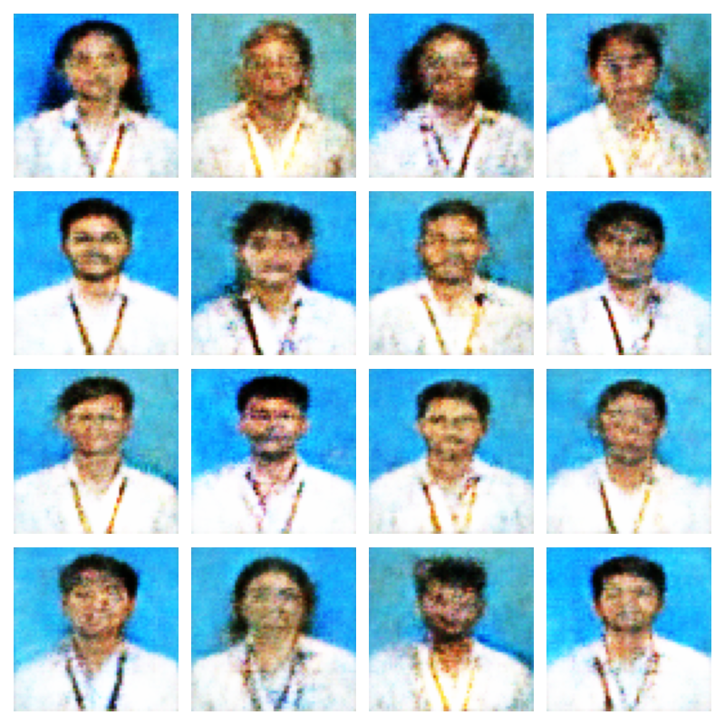
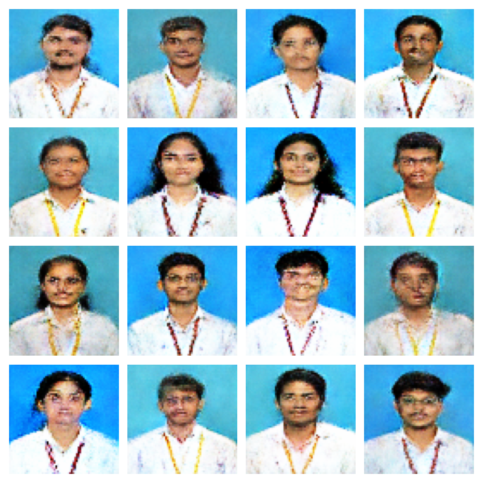

# AI Human Face Generation using WGAN-GP

## Table of Contents

## Table of Contents

* [Overview](#overview)
* [Objectives](#objectives)
* [Dataset Description](#dataset-description)
* [Requirements](#requirements)
* [Installation](#installation)
* [Preprocessing & Augmentation](#preprocessing--augmentation)
* [Project Structure](#project-structure)
* [Model Architecture](#model-architecture)

  * [Generator](#generator)
  * [Critic](#critic)
* [Training Configuration](#training-configuration)
* [Features](#features)
* [Results](#results)
* [Loss Curve](#loss-curve)
* [Problems Faced](#problems-faced)
* [Solutions Implemented](#solutions-implemented)
* [Performance Summary](#performance-summary)
* [Extended Training Experiments](#extended-training-experiments)
* [Quantitative Evaluation](#quantitative-evaluation)
* [Additional Validation Checks](#additional-validation-checks)
* [Lessons Learned](#lessons-learned)
* [Current Project Status](#current-project-status)
* [Future Improvements](#future-improvements)
* [Author](#author)


---

# Overview

This project focuses on generating realistic human face images using a custom dataset of 2,776 face photographs. A Wasserstein Generative Adversarial Network with Gradient Penalty (WGAN-GP) was implemented using TensorFlow and Keras to improve training stability and image quality.

The model learns the underlying distribution of human faces and generates new synthetic faces from random noise vectors.

---

# Objectives

* Generate realistic human face images from random noise.
* Understand and implement GAN architectures.
* Explore training stability techniques for GANs.
* Reduce mode collapse and unstable training.
* Build a complete end-to-end image generation pipeline.
* Gain hands-on experience with WGAN-GP.

---

# Dataset Description

| Property      | Value               |
| ------------- | ------------------- |
| Dataset Type  | Custom Face Dataset |
| Total Images  | 2,776               |
| Image Size    | 64 × 64             |
| Channels      | RGB                 |
| Format        | JPG / PNG           |
| Normalization | [-1, 1]             |

Dataset contains student face images captured under relatively similar lighting and background conditions.

---

# Requirements

```bash
tensorflow
keras
numpy
matplotlib
opencv-python
pillow
tqdm
```

---

# Installation

```bash
git clone https://github.com/your-username/human-face-generation.git

cd human-face-generation

pip install -r requirements.txt
```

---

# Preprocessing & Augmentation

## Image Preprocessing

* Resize images to 64×64
* Convert to RGB
* Normalize pixel values to [-1,1]
* Create TensorFlow Dataset Pipeline

## Data Augmentation

Implemented:

```python
RandomFlip("horizontal")

```

Benefits:

* Increased dataset diversity
* Improved generalization
* Reduced overfitting

---

# Project Structure

```text
Human_Face_Generator/
│
├── dataset/
│
├── generated_images/
│
├── checkpoints/
│
├── graphs/
│
├── models/
│
├── logs/
│
├── human-face-generator.ipynb
│
└── README.md
```

---

# Model Architecture

## Generator

Input:

```text
100-Dimensional Random Noise Vector
```

Architecture:

```text
Dense
↓
Batch Normalization
↓
LeakyReLU
↓
Reshape (4×4×1024)
↓
Conv2DTranspose (512)
↓
Batch Normalization
↓
LeakyReLU
↓
Conv2DTranspose (256)
↓
Batch Normalization
↓
LeakyReLU
↓
Conv2DTranspose (128)
↓
Batch Normalization
↓
LeakyReLU
↓
Conv2DTranspose (3)
↓
Tanh
```

Output:

```text
64×64×3 Face Image
```

---

## Critic

Architecture:

```text
Input Image
↓
Conv2D (64)
↓
LeakyReLU
↓
Conv2D (128)
↓
LeakyReLU
↓
Conv2D (256)
↓
LeakyReLU
↓
Conv2D (512)
↓
LeakyReLU
↓
Flatten
↓
Dense(1)
```

Note:

* No Sigmoid Layer
* No Batch Normalization
* No Dropout

This design follows WGAN-GP recommendations.

---

# Training Configuration

```python
IMAGE_SIZE = 64
LATENT_DIM = 100

BATCH_SIZE = 64

GEN_LR = 1e-4
DISC_LR = 1e-4

CRITIC_ITERATIONS = 5

LAMBDA_GP = 10

BETA_1 = 0.0
BETA_2 = 0.9
```

---

# Features

* Custom WGAN-GP Implementation
* Gradient Penalty
* TensorFlow Dataset Pipeline
* Automatic Checkpoint Saving
* Generated Image Saving
* Loss Visualization
* GPU Training Support
* Custom Face Dataset
* Data Augmentation
* Training Monitoring

---
# Results

## Generated Images

### Epoch 20

<p align="center">
  
  <br>
  <b>Epoch 20 Output</b>
</p>

### Epoch 80

<p align="center">
  
  <br>
  <b>Epoch 80 Output</b>
</p>

### Epoch 130 (Best Result)

<p align="center">
  
  <br>
  <b>Epoch 130 Output</b>
</p>

### Epoch 220

<p align="center">
  
  <br>
  <b>Epoch 220 Output</b>
</p>

Generated images gradually evolved from random noise into recognizable human faces.

The best visual quality was achieved around Epoch 130. Training beyond this point produced only marginal improvements and eventually led to a slight reduction in image diversity and sharpness.


# Problems Faced

## 1. Generated Images Were Pure Noise

Initial training produced random noise and blurry patches instead of faces.

### Impact

* No recognizable facial features
* Poor convergence

---

## 2. Critic Dominated Training

Observed loss values:

```text
Generator Loss ≈ -1000
Critic Loss ≈ -6000
```

### Impact

* Generator stopped improving
* Unstable training

---

## 3. Dropout Reduced Critic Performance

Dropout layers were originally included in the Critic.

### Impact

* Weaker feature extraction
* Slower convergence

---

## 4. Checkpoint Conflicts

Old checkpoints were automatically loaded during new experiments.

### Impact

* Inconsistent results
* Difficult debugging

---

## 5. Experiment Tracking Issues

Generated image folders contained outputs from previous runs.

### Impact

* Difficult to compare experiments
* Confusing results

---

# Solutions Implemented

## WGAN-GP

Replaced standard GAN loss with:

* Wasserstein Loss
* Gradient Penalty

Benefits:

* Stable training
* Better convergence
* Reduced mode collapse

---

## Balanced Learning Rates

Changed training configuration to:

```python
GEN_LR = 1e-4
DISC_LR = 1e-4
CRITIC_ITERATIONS = 5
```

Benefits:

* Better Generator-Critic balance
* Improved image quality

---

## Removed Dropout

Removed all Dropout layers from the Critic.

Benefits:

* Better feature learning
* Faster convergence

---

## Fresh Training Runs

Before training:

```python
Delete old checkpoints
Delete old generated images
```

Benefits:

* Reproducible experiments
* Easier debugging

---

## Dataset Verification

Verified:

```python
images.min() = -1.0
images.max() = 1.0
```

Confirmed preprocessing pipeline was correct.

---

## Training Evaluation

### Training Stability

The Generator and Critic losses gradually stabilized during training, indicating balanced adversarial learning.

Final observed values:

| Metric         | Value   |
| -------------- | ------- |
| Generator Loss | ~6.57   |
| Critic Loss    | ~-10.36 |

Observations:

* Stable training throughout later epochs
* No sudden spikes in losses
* No exploding gradients
* No training divergence
* Critic and Generator remained balanced

---

### Generated Image Quality

The model successfully learned:

* Human facial structure
* Hair patterns
* Clothing appearance
* ID card patterns
* Background color distribution
* Male and female face variations

Generated images evolved from random noise into recognizable face images.

Limitations:

* Images remain slightly blurry
* Fine facial details are not fully learned
* Eye and hair textures require improvement
* Limited by 64×64 image resolution

---

### Mode Collapse Analysis

Mode collapse occurs when a GAN repeatedly generates the same image.

Results:

✅ Different face shapes generated

✅ Different hairstyles generated

✅ Different genders generated

✅ Different facial structures generated

Conclusion:

The model did not exhibit significant mode collapse.

---

### Divergence Analysis

Training divergence occurs when Generator and Critic losses become unstable or explode.

Checks performed:

* Loss monitoring
* NaN detection
* Visual inspection of generated samples

Results:

```text
Generator NaN: False
Critic NaN: False
```

Conclusion:

No divergence was observed during training.

---

### Inception Score Evaluation

The trained model was evaluated using Inception Score (IS).

Results:

```text
Inception Score : 1.4075
Std             : 0.0429
```

Interpretation:

* Indicates limited image sharpness
* Expected due to small dataset size
* Expected due to 64×64 image resolution
* Generated images are visually better than the score alone suggests

---

## Experimental Improvements

Several improvements were introduced during development:

### Architecture Improvements

* Implemented WGAN-GP instead of Vanilla GAN
* Added Gradient Penalty
* Removed Sigmoid activation from Critic
* Removed Dropout layers from Critic
* Used LeakyReLU activations
* Used Batch Normalization in Generator

### Training Improvements

* Balanced Generator and Critic learning rates
* Tuned Critic iterations
* Used Adam optimizer with WGAN-GP parameters
* Implemented checkpoint saving
* Added TensorBoard logging
* Added automatic image generation after every epoch

### Dataset Improvements

* Verified image normalization range
* Applied online data augmentation
* Implemented shuffle and prefetch pipeline
* Removed invalid image files

---

## Key Challenges Faced

### 1. Generated Images Were Pure Noise

Issue:

* Early epochs generated random noisy patterns.

Resolution:

* Trained for more epochs.
* Tuned WGAN-GP hyperparameters.
* Balanced Generator and Critic learning rates.

---

### 2. Critic Became Too Strong

Issue:

```text
Generator Loss ≈ -1000
Critic Loss ≈ -6000
```

Resolution:

* Reduced Critic dominance.
* Adjusted Critic iterations.
* Rebalanced learning rates.

---

### 3. Dropout Reduced Critic Performance

Issue:

* Critic learned weak image features.

Resolution:

* Removed all Dropout layers from Critic.

Result:

* Better feature extraction.
* Faster convergence.

---

### 4. Old Generated Images Caused Confusion

Issue:

* Previous experiment images remained in the output directory.

Resolution:

```python
shutil.rmtree(GENERATED_DIR, ignore_errors=True)
os.makedirs(GENERATED_DIR, exist_ok=True)
```

---

### 5. Old Checkpoints Affected Experiments

Issue:

* Training accidentally resumed from previous checkpoints.

Resolution:

```python
shutil.rmtree(CHECKPOINT_DIR, ignore_errors=True)
os.makedirs(CHECKPOINT_DIR, exist_ok=True)
```

---

### 6. Dataset Verification

Issue:

* Generated images appeared washed out and blurry.

Investigation:

Verified normalization:

```python
images.min()
images.max()
```

Output:

```text
-1.0
1.0
```

Conclusion:

Preprocessing pipeline was correct.

---

## Performance Summary

| Metric            | Result       |
| ----------------- | ------------ |
| Dataset Size      | 2,776 Images |
| Resolution        | 64×64        |
| GAN Type          | WGAN-GP      |
| Training Stable   | Yes          |
| Mode Collapse     | No           |
| Divergence        | No           |
| NaN Losses        | No           |
| Inception Score   | 1.4075       |
| Checkpointing     | Yes          |
| Data Augmentation | Yes          |
| GPU Training      | Yes          |

---

## Extended Training Experiments

To analyze the effect of longer training durations, additional experiments were performed beyond the initial training phase.

### Training Progress

| Epoch | Observation                                                          |
| ----- | -------------------------------------------------------------------- |
| 20    | Faces became recognizable but remained blurry                        |
| 80    | Clear facial structures emerged with improved background consistency |
| 130   | Best visual quality achieved with stable facial features             |
| 220   | Slight degradation observed in image sharpness and diversity         |

### Best Performing Epoch

Among all experiments, the checkpoint around **Epoch 130** produced the most visually convincing results.

Observed improvements:

* Better facial alignment
* Improved hairstyle generation
* More realistic clothing patterns
* Better separation between face and background
* Reduced random artifacts

### Effect of Extended Training

Training beyond 130 epochs did not significantly improve image quality.

Observed at 220 epochs:

* Slight reduction in image diversity
* Increased facial similarity between samples
* Marginal decrease in sharpness
* Lower Inception Score

This indicates that additional training was not beneficial for the current dataset size and model configuration.

---

## Quantitative Evaluation

### Inception Score

The trained model was evaluated using the Inception Score metric.

| Epoch | Inception Score |
| ----- | --------------- |
| 130   | 1.4075 ± 0.0429 |
| 220   | ~1.30           |

### Interpretation

The decrease in score after prolonged training suggests:

* Limited benefit from additional epochs
* Possible beginning of overfitting
* Reduced output diversity

Because the dataset contains only 2,776 images and uses a resolution of 64×64, the obtained score is considered reasonable for this experimental setup.

---

## Additional Validation Checks

Several checks were performed to verify training quality.

### NaN Detection

Results:

```text
Generator NaN : False
Critic NaN    : False
```

No numerical instability was detected during training.

### Training Stability

Observed:

* Smooth Generator loss curve
* Smooth Critic loss curve
* No exploding gradients
* No sudden oscillations

Result:

✅ Stable WGAN-GP training

### Diversity Check

Generated samples were visually inspected.

Observed:

* Multiple face shapes
* Multiple hairstyles
* Male and female faces
* Different facial structures

Result:

✅ No significant mode collapse detected

---

## Lessons Learned

Through experimentation, several practical observations were made:

* WGAN-GP provides significantly more stable training than a standard GAN.
* Removing Dropout from the Critic improved learning quality.
* Dataset quality affects results more than increasing epochs.
* Training longer does not always produce better images.
* Monitoring generated samples is more informative than monitoring loss values alone.
* Clearing checkpoints and generated images before new experiments avoids misleading results.
* Small datasets limit achievable image quality regardless of training duration.

---

## Current Project Status

Current model capabilities:

✅ Generates realistic face-like images

✅ Produces diverse face structures

✅ Learns background and clothing patterns

✅ Stable training without divergence

✅ No significant mode collapse

Limitations:

❌ Images remain slightly blurry

❌ Fine facial details are not fully captured

❌ Limited by 64×64 resolution

❌ Limited by dataset size (2,776 images)

❌ Inception Score remains relatively low


## Future Improvements

Planned improvements:

* Increase dataset size beyond 10,000 images
* Train using 128×128 resolution images
* Experiment with adaptive augmentation
* Compute FID Score for stronger evaluation
* Explore StyleGAN2 and StyleGAN3 architectures
* Perform latent space exploration and interpolation
* Introduce attention mechanisms in the Generator
* Use mixed precision training for faster convergence


---

# Author

**Sujan K S**

Artificial Intelligence & Machine Learning

GANs • Deep Learning • Computer Vision • Generative AI
